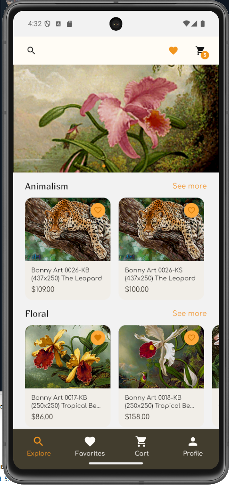
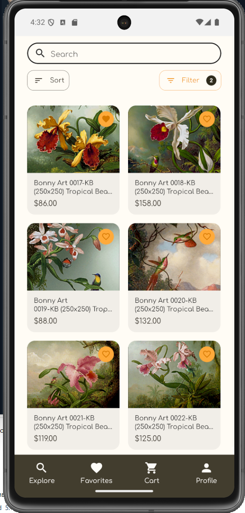
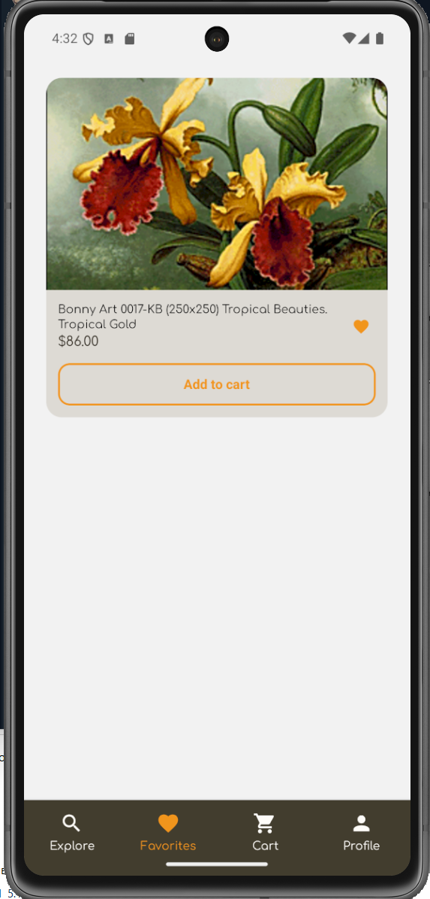
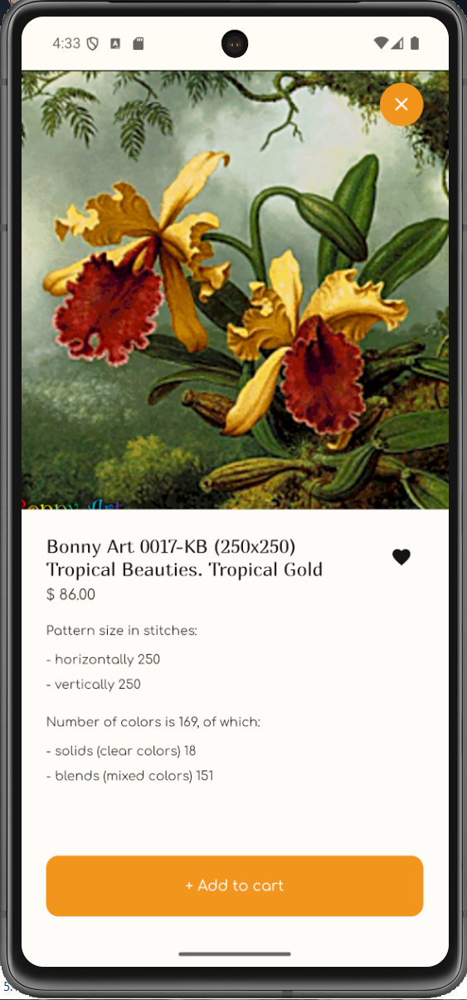
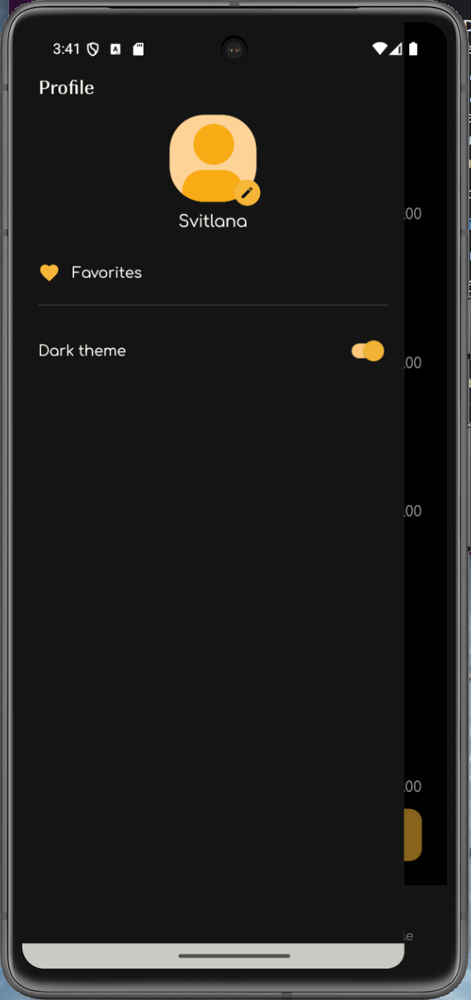
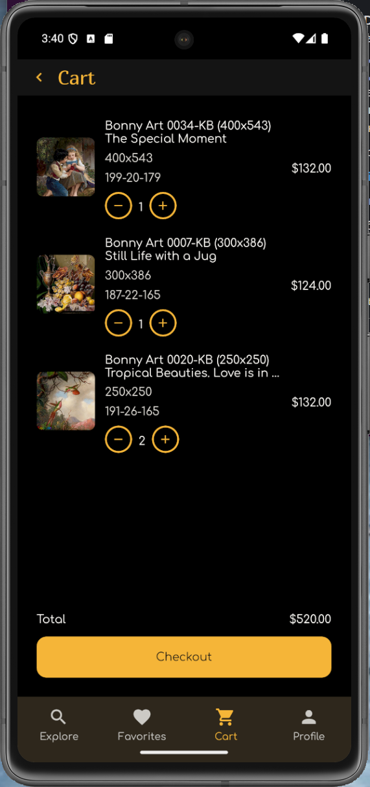
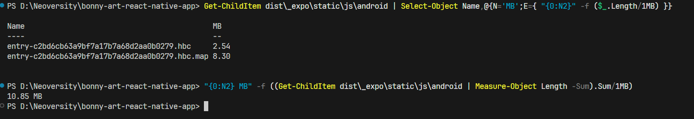
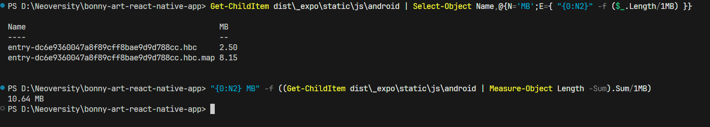

# cross_assignment_3

1. FilterChip

   

2. IconButton

   

3. OrderStepper

   

4. PrimaryButton

   

5. ProductCard

   
   
   

6. UserAvatar

   

# cross_assignment_4

1. Mobile app navigation demo

   <video src="./docs/video/Video01.mp4" controls playsinline muted loop width="600">
  Your browser does not support the video tag.
</video>

# cross_assignment_5

1. ExploreTab



2. CategoryScreen



3. FavoritesTab



4. ProductModal



# cross_assignment_6

1. ThemeTogle



2. CartList



# cross_assignment_7

## Завдання 2. Додати анімацію з LayoutAnimation або Reanimated

У застосунку використана анімація на Reanimated:

- FilterModal використовує useSharedValue, useAnimatedStyle та withTiming для плавного появлення та закриття модального вікна

- HeroCarousel анімує індикатори сторінок за допомогою useAnimatedStyle і withTiming, реагуючи на зміну активного слайду

## Завдання 3. Оптимізація ререндерів через memo / useMemo / useCallback

у проєкті реалізовано оптимізацію повторних ререндерів через React.memo, useMemo та useCallback:

- Компонент CartItemRow обгорнутий у React.memo, що запобігає зайвим повторним рендерам

- На екрані кошика обчислення списку елементів (data) та суми (total) виконуються через useMemo, а функції для зміни кількості й рендеру елементів стабілізовані через useCallback

- Компоненти ProductCard та FilterChip також експортуються з обгорткою memo

## Завдання 4. Очищення / заміна залежностей

- Провела ревізію залежностей; виявила зайву важку залежність axios.

- Видалила axios і перевела запити на вбудований fetch.

- Зібрала прод-бандли:
  `npx expo export --platform android --output-dir dist --dump-sourcemap`

- Виміряла розміри Android-бандла в PowerShell (показ кожного файлу та сумарно):

```
# список файлів з розмірами
Get-ChildItem dist\_expo\static\js\android | Select-Object Name,@{N='MB';E={ "{0:N2}" -f ($_.Length/1MB) }}

# сумарний розмір
"{0:N2} MB" -f ((Get-ChildItem dist\_expo\static\js\android | Measure-Object Length -Sum).Sum/1MB)
```

За підсумком прод-збірки (Expo export) і вимірювань у PowerShell розмір Android-бандла зменшився:

- entry-\*.hbc: 2,54 → 2,50 MB
- entry-\*.hbc.map: 8,30 → 8,15 MB
- Разом: 10,85 → 10,64 MB (−0,21 MB, ≈ −1,9%).

Зменшення зафіксовано скріншотами “до/після”.

До видалення axios



Після видалення axios


