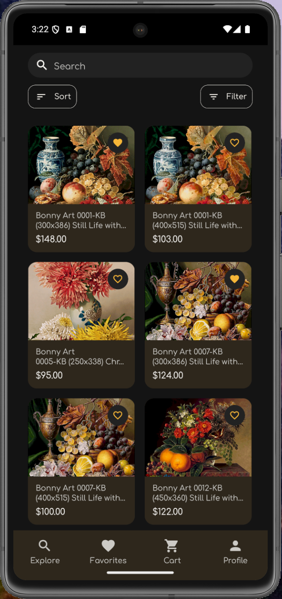
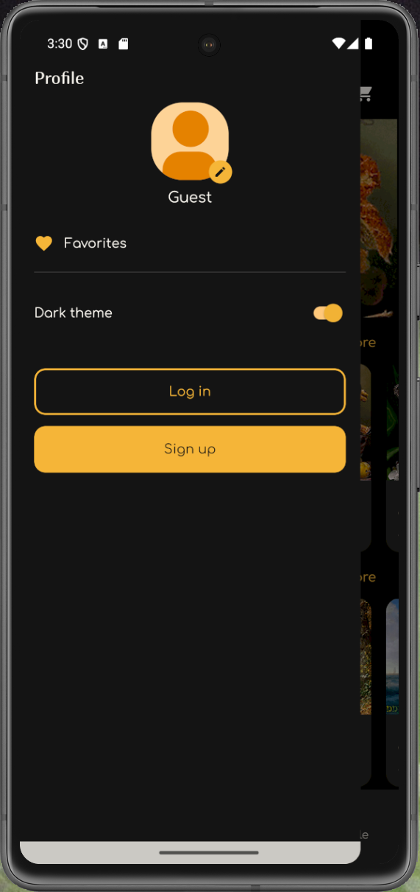

# Завдання 1

## 1. Аналіз існуючого застосунку?

Застосунок зараз нагадує маленький магазин зі схемами для вишивки. Нижче я описую головні дії, які я можу виконати.

### Головний екран «Explore»

- На екрані є велика карусель з популярними товарами, а під ним блоки з різними категоріями.
- Якщо я тисну на картку, відкривається модальне вікно з деталями. Там можна додати товар у кошик або позначити його сердечком.
- Верхня панель дозволяє швидко перейти до обраних товарів, у кошик або у просте вікно пошуку.

### Перегляд категорій

- Коли я відкриваю категорію, я бачу її назву і двоколонкову стрічку з товарами, яка підвантажується нескінченно.
- Заголовок прилипає зверху. У ньому є кнопки для пошуку, сортування і фільтрів.
- Фільтр відкриває модальне вікно. Там я можу вибрати діапазони кольорів, розмірів або типи ниток, а потім застосувати чи скинути вибір.

### Вкладка «Favorites»

- У вкладці з обраними показуються збережені товари. Список теж підвантажується частинами.
- Звідси я можу швидко відкрити товар у модальному вікні або відправити його в кошик.
- Якщо я прибираю товар з обраних, список одразу оновлюється без перезавантаження.

### Модальне вікно товару

- Тут видно галерею зображень, ціну, доступні розміри і кількість кольорів.
- Кнопка «Add to cart» додає товар до кошика і змінює стан, якщо він уже там є.

### Кошик і оформлення замовлення

- На вкладці кошика програма підтягує дані по кожній позиції, показує керування кількістю і суму замовлення.
- Кнопка оформлення веде на екрани з кроками замовлення і фінальним повідомленням про успіх.

### Типові сценарії

1. Я відкриваю застосунок, гортаю головну стрічку, натискаю на товар, переглядаю деталі і додаю його у кошик. Потім переходжу у кошик і починаю оформлення.
2. Я заходжу у категорію, відкриваю фільтри, вибираю потрібний розмір і дивлюся відфільтровані результати. Пізніше відкриваю обрані і видаляю те, що вже не потрібно.

## 2. Зони розширення функціональності

Я бачу кілька місць, де хочу додати нові можливості, щоб зробити застосунок кориснішим.

1. **Обліковий запис і вхід.** Планую додати екрани входу і реєстрації, зберігання сесії та синхронізацію кошика з профілем користувача.
2. **Розумніший пошук.** Хочу зробити повноцінне поле пошуку з підказками, історією запитів і передачею результатів у екран категорії.
3. **Зв’язок кошика та обраних з профілем.** Планую, щоб у незалогіненого користувача деякі дії блокувалися з поясненням, а після входу обрані товари та кошик синхронізувалися із сервером.

# Завдання 2

## 1. Розширення функціоналу

### Нові функції

- З’явилися повноцінні екрани входу і реєстрації. Вони перевіряють форму, хешують пароль, створюють користувача через mock-API і зберігають сесію в AsyncStorage. Також при вході кошик зливається з даними профілю, щоб користувач не втрачав вибрані товари.
- Є окреме модальне вікно пошуку. Воно пам’ятає останні запити в AsyncStorage, дозволяє швидко підставити пошук для конкретної категорії і записує запит у Redux, щоб стрічка товарів одразу підхоплювала фільтр.
- Процес оформлення замовлення став кроком з формою. Тепер є валідація email і країни через Formik та Yup, обов’язкова згода, автоматичне підставлення пошти авторизованого користувача і перевірка, чи кориостувач залогінений перед оплатою.

### Керування станом

- До змін я мала тільки два зрізи Redux Toolkit: кошик і фільтри. Обидва слухали AsyncStorage, щоб зберігати товари і налаштування локально.
- Зараз з’явилися додаткові зрізи: auth для користувача та сесії і search для пошукових запитів по категоріях. Auth слідкує за сесією, синхронізує кошик з профілем і прибирає локальне збереження, коли коритсувач залогінений. Search тримає текст пошуку для кожної категорії, щоб екран міг показати правильні товари.
- Також я використовую окремий React Context, який зберігає вибір темної чи світлої теми. Через нього будь-який екран може перемкнути тему без зайвих пропсів.
- Я лишилася на Redux Toolkit, бо він вже стояв у проєкті, має зрозумілий синтаксис і дозволяє слухачам реагувати на дії. AsyncStorage обраний для локальної пам’яті: він працює на телефоні і не вимагає сервера, тому підходить для демо.

### Компонентний підхід

- Для авторизації зроблені окремі компоненти LoginForm і SignUpForm у власних папках. Вони використовують спільні поля TextField та кнопки, що живуть у шарі shared/ui і теж лежать у власних файлах.
- Кошик розкладено по модулях: CartScreen, CartItemRow і SuccessScreen тепер кожен у своїй теці з окремим файлом, стилями і типами. Це робить код читабельнішим і дозволяє перевикористати рядок товару в інших місцях.
- Розширено існуючі блоки на головних екранах: ProductCard, ProductModal і ProfileDrawerContent отримали додаткові пропси та логіку, але кожен компонент усе ще лежить у власному файлі зі стилями та константами поряд. Це допомагає тримати модульність і не змішувати різні частини інтерфейсу.

# Завдання 3. Покращення UX/UI

Якщо подивитись на попередню версію застосунку, помітно, що там інтерфейс більш «сирий». У теперішньому стані я підтягнула вигляд і поведінку кількома кроками.

1. **Форми і модалки стали акуратнішими.** Я винесла поля вводу у власний компонент TextField, який автоматично підбирає кольори теми, показує помилки та дозволяє безпечно приховувати або відкривати пароль, тож форми логіну й реєстрації виглядають однаково і зручні для користування. Підтвердження важливих дій тепер відбувається через ActionModal з напівпрозорим бекдропом, кнопками в єдиному стилі PrimaryButton та плавною анімацією зникнення, завдяки чому усі діалоги мають однаковий вигляд.

2. **Екрани отримали чіткі шапки і адаптацію під тему.** Наприклад, новий FavoritesScreen будує власний заголовок з кнопкою «назад», використовує стан авторизації, тематичні кольори та підключає ті самі кнопки і картки товарів, тому список обраних виглядає цілісно й у світлій, і в темній темі. Для стеку кошика я додала компактний header з акцентним кольором і безпечними відступами, що робить переходи між кроками замовлення більш плавними та читабельними.

3. **Навігація стала зрозумілішою.** Тепер я розвела всі шляхи в одному модулі, створила хелпери на кшталт toProductModal чи toCartSuccess і передаю параметри явними об’єктами, тому легко побачити, які екрани відкриваються і які дані їм потрібні. У кореневому екрані AuthGate я або показую спінер, або одразу перекидаю користувача в потрібний стек, тож зайвих миготінь між авторизацією та вкладками немає. Окремий стек модалок із presentation="modal" відповідає за плавні появи пошуку й перегляду товару, а нові модальні екрани (наприклад SearchModal) зчитують параметри через useLocalSearchParams і повертають результат у список, не гублячи контекст категорії. Нарешті, фінальний екран замовлення читає total із параметрів маршруту, які я передаю за допомогою toCartSuccess, і дозволяє одним натиском повернутися до вкладок без повторного введення даних.

# Екрани додатку

**Explore (головний екран)** – показує карусель топових товарів, секції за категоріями та швидкі дії InfoBar, а також обробляє сценарії переходу до обраного та кошика.

**Category screen** – підтягує назву категорії, підтримує сортування, пошук і нескінченну підвантажку з урахуванням збережених фільтрів та авторизації для обраного.

**Product details modal** – відкриває товар у модальному вікні з галереєю, характеристиками, додаванням у кошик і перевіркою авторизації для “вподобайки”.

**Favorites screen** – керує списком збережених товарів, пропонує логін, дає змогу відкривати модальне вікно товару та додавати позиції до кошика.

**Cart & checkout flow** – включає кошик із підрахунком суми й нагадуванням про логін, екран оформлення замовлення з формою та кроками, а також фінальний екран успіху з підсумком платежу.

**Search modal та Filter modal, Sort button** – забезпечують пошук у межах категорії з історією запитів та застосування комбінацій фільтрів за кольором, розміром і типом ниток, а також сортування за зростанням чи спаданням ціни.

**Authentication flow (Auth Gate, Login, Sign Up)** – описує стартовий редірект залежно від статусу користувача, екран входу з каруселлю і формою, а також екран реєстрації. Також є можливість швидкого переходу до застосунку без облікового запису.

**Profile drawer** – містить аватар і дані користувача, перемикач теми, кнопки для улюбленого та дій входу/виходу з відповідними підтвердженнями.

